# Prism — VBD Architectural Refactor Plan
**Status:** Draft
**Reference:** William Anderson, "Volatility-Based Decomposition in Software Architecture" (Feb 2026)

---

## 1. Volatility Analysis

Prism's sources of change, ranked by frequency and blast radius:

| Axis | Volatility | Examples |
|---|---|---|
| **Platform behavior** (mac/win/linux) | High | Tool install commands, package manager, path conventions |
| **Prism schema** (what fields mean) | High | New tier types, new bundled_prisms keys, new config sections |
| **UI interactions** (wizard steps, fields) | High | Step order, tier selectors, theme application |
| **Tool installation logic** | Medium | How brew/choco/apt is invoked, which tools are installable |
| **Merge rules** | Medium | Union vs. append vs. override strategies |
| **External integrations** (npm, CDN, git, SSH) | Medium | API changes, auth changes, network topology |
| **Orchestration sequence** (step order) | Low | What runs first — rarely changes once stable |
| **Logging / progress reporting** | Low | Format changes, but interface is stable |

---

## 2. Current Architecture Problems

### `installer_engine.py` — does everything
This single class currently acts as:
- **Manager** (orchestrates 11 steps in sequence)
- **Engine** (resolves which tools to install, how)
- **Resource Accessor** (git operations, SSH key generation, file copy, brew/apt/choco)
- **Utility** (platform detection, logging)

Any change to git — for example, adding signing key support — touches the same file as adding a new install step. A new platform requires changes across platform detection, package manager install, git install, tool install, and SSH key generation — all in one file.

### `install-ui.py` — 2500-line monolith
- Flask routes, HTML, CSS, and JavaScript all inline
- UI logic (wizard navigation, tier loading, summary) embedded in one string constant
- The API layer and the presentation layer cannot evolve independently

### `scripts/package_manager.py` — two unrelated concerns
- `discover_packages()` — a **Resource Accessor** (reads the filesystem)
- `create_package_scaffold()` — an **Engine** (generates files from a template)

---

## 3. Target VBD Structure

```mermaid
%%{init: {'theme': 'base', 'themeVariables': {'primaryColor': '#eef2ff', 'primaryTextColor': '#1e293b', 'primaryBorderColor': '#6366f1', 'lineColor': '#6366f1', 'secondaryColor': '#f0fdf4', 'tertiaryColor': '#faf5ff', 'background': '#ffffff', 'mainBkg': '#eef2ff', 'nodeBorder': '#6366f1', 'clusterBkg': '#f8faff', 'edgeLabelBackground': '#ffffff'}}}%%

flowchart TD
    subgraph managers["Managers — orchestration, stable"]
        IM["InstallationManager\nCoordinates 11 install steps"]
        UIM["UIManager\nOrchestrates API surface"]
    end

    subgraph engines["Engines — business rules, volatile"]
        CME["ConfigMergeEngine\nSub-prism merging"]
        PVE["PrismValidationEngine\nSchema validation"]
        TRE["ToolResolutionEngine\ntools_required + selected - excluded"]
        SE["ScaffoldEngine\nGenerates new prisms"]
        PFE["PreflightEngine\npackage.requires checks"]
    end

    subgraph accessors["Resource Accessors — I/O boundary, volatile"]
        PRA["PrismRegistryAccessor\nLocal + remote discovery + fetch"]
        FSA["FilesystemAccessor\nWorkspace, file copy, marker"]
        GA["GitAccessor\nInstall · configure · clone · SSH"]
        PMA["PlatformPackageManagerAccessor\nbrew / choco / apt"]
    end

    subgraph utilities["Utilities — cross-cutting, orthogonal"]
        PL["ProgressLogger\nstep · message · level"]
        PD["PlatformDetector\nmac · windows · linux"]
        EVS["EnvVarSubstitutor\n${VAR:-default}"]
        LR["LocaleRenderer\nt(key) → string"]
    end

    IM --> CME
    IM --> PVE
    IM --> TRE
    IM --> PFE
    IM --> PRA
    IM --> FSA
    IM --> GA
    IM --> PMA
    UIM --> PRA
    UIM --> CME
    UIM --> PVE

    IM --> PL
    IM --> PD
    CME --> EVS
    UIM --> LR

    style managers fill:#faf5ff,stroke:#a855f7,color:#1e293b
    style engines fill:#eef2ff,stroke:#6366f1,color:#1e293b
    style accessors fill:#f0fdf4,stroke:#22c55e,color:#1e293b
    style utilities fill:#fff7ed,stroke:#f97316,color:#1e293b
```



```
prism/
├── managers/
│   ├── installation_manager.py     # Orchestrates install steps (stable)
│   └── ui_manager.py               # Orchestrates wizard API surface (stable)
│
├── engines/
│   ├── config_merge_engine.py      # Sub-prism merging (from config_merger.py)
│   ├── prism_validation_engine.py  # Schema validation (from package_validator.py)
│   ├── tool_resolution_engine.py   # Resolves tools_required + selected - excluded
│   ├── scaffold_engine.py          # Generates new prism scaffolds (from package_manager.py)
│   └── preflight_engine.py        # Checks package.requires before install
│
├── accessors/
│   ├── prism_registry_accessor.py  # Local + remote prism discovery and fetch
│   ├── filesystem_accessor.py      # Workspace creation, file copy, marker write
│   ├── git_accessor.py             # git install, configure, clone, SSH key gen
│   └── platform_package_manager_accessor.py  # brew / choco / apt
│
├── utilities/
│   ├── progress_logger.py          # step/message/level callback interface
│   ├── platform_detector.py        # mac / windows / linux detection
│   ├── env_var_substitutor.py      # ${VAR:-default} substitution (from config_merger.py)
│   └── locale_renderer.py          # i18n string loading and rendering
│
├── ui/
│   ├── server.py                   # Flask app, route registration only
│   ├── api/
│   │   ├── packages.py             # /api/packages, /api/package/<name>/*
│   │   ├── install.py              # /api/install
│   │   └── tools.py                # /api/tools
│   └── static/
│       ├── index.html
│       ├── css/
│       │   ├── base.css
│       │   └── themes.css
│       └── js/
│           ├── wizard.js           # Step navigation, state
│           ├── tiers.js            # Tier loader
│           ├── install.js          # Install call + progress stream
│           └── locale.js           # i18n string lookup
│
├── scripts/                        # CLI entrypoints (thin wrappers only)
│   ├── package_manager.py          # CLI for scaffold + discover (calls engines/accessors)
│   ├── package_validator.py        # CLI for validation (calls engine)
│   └── npm_package_fetcher.py      # CLI for fetch (calls accessor)
│
└── install.py                      # CLI entrypoint (calls installation_manager)
```

---

## 4. Communication Rules (VBD)

Following the IDesign methodology:

| From | To | Allowed? | Mechanism |
|---|---|---|---|
| Manager | Engine | Yes | Direct call |
| Manager | Accessor | Yes | Direct call |
| Manager | Manager | Only if async/fire-and-forget | Queue |
| Engine | Engine | No | — |
| Engine | Accessor | No | — |
| Accessor | Engine | No | — |
| Accessor | Accessor | No | — |
| Anything | Utility | Yes | Direct call |
| Utility | Anything (except other utilities) | No | — |

---

## 5. Migration Steps

### Phase A — Extract Utilities (no behavior change)
1. Extract `ProgressLogger` from `InstallationEngine.log()`
2. Extract `PlatformDetector` from `InstallationEngine._detect_platform()`
3. Extract `EnvVarSubstitutor` from `ConfigMerger._substitute_env_vars()`

### Phase B — Extract Accessors (isolate I/O)
4. Extract `GitAccessor` — install git, configure git, clone repos, generate SSH keys
5. Extract `FilesystemAccessor` — create folders, copy prism, write marker
6. Extract `PlatformPackageManagerAccessor` — brew/choco/apt
7. Extract `PrismRegistryAccessor` — local discovery + npm/CDN fetch (merges `package_manager.discover_packages` + `npm_package_fetcher`)

### Phase C — Extract Engines (isolate volatile logic)
8. `ConfigMergeEngine` — rename/move from `config_merger.py`, keep interface
9. `PrismValidationEngine` — rename/move from `package_validator.py`, keep interface
10. `ToolResolutionEngine` — extract from `InstallationEngine._get_tools_from_merged_config()`; add `tools_selected`/`tools_excluded` logic
11. `ScaffoldEngine` — extract from `PackageManager.create_package_scaffold()`
12. `PreflightEngine` — new; implements `package.requires` checks

### Phase D — Clean up Managers
13. `InstallationManager` — thin orchestrator; calls accessors and engines via the step sequence; no I/O of its own
14. `UIManager` — Flask routes split into `api/` modules; no HTML inline

### Phase E — UI separation
15. Extract `INDEX_HTML` into `ui/static/index.html`
16. Extract CSS into `ui/static/css/base.css` + `themes.css`
17. Extract JS into `ui/static/js/wizard.js`, `tiers.js`, `install.js`, `locale.js`

---

## 6. Core Use Cases (Architectural Validation)

These must work end-to-end after refactor:

1. **CLI install** — `python3 install.py --prism personal-dev` → full workspace created
2. **Web UI install** — User picks prism, fills info, selects tiers → install completes via API
3. **Prism validation** — `python3 scripts/package_validator.py prisms/personal-dev` → valid/invalid reported
4. **Prism creation** — `python3 scripts/package_manager.py create my-company` → scaffold written to `prisms/`
5. **Remote prism fetch** — UI loads packages; if local, uses `PrismRegistryAccessor.discover_local()`; if remote source configured, falls back to CDN

---

## 7. Risk Notes

- `installer_engine.py` has integration tests (`tests/integration/test_installer_engine.py`) — run after each phase
- Flask routes must stay at same URL paths (API contract)
- `config_merger.py` and `package_validator.py` are imported by tests by relative path — imports must be updated

---

## Progress

- [ ] Phase A: Extract utilities
- [ ] Phase B: Extract accessors
- [ ] Phase C: Extract engines
- [ ] Phase D: Clean up managers
- [ ] Phase E: UI separation
- [ ] All integration tests green after refactor
