# Docs Restructure + Local Documentation Server
**Status:** In Progress

---

## 1. The Problem

### Current layout (confusing)
```
prism/
├── README.md                          ← user-facing
├── CONTRIBUTING.md                    ← developer-facing (duplicate of docs/development/contributing.md)
├── docs/
│   ├── README.md                      ← index
│   ├── PLAYWRIGHT_DASHBOARDS.md       ← misplaced (testing artifact, not user guide)
│   ├── development/
│   │   ├── ci-cd.md
│   │   ├── contributing.md
│   │   └── testing.md
│   ├── getting-started/
│   │   ├── installation.md
│   │   └── quickstart.md
│   ├── reference/
│   │   ├── configuration-schema.md
│   │   ├── npm-packages.md
│   │   └── package-system.md
│   └── user-guide/
│       ├── choosing-a-prism.md
│       ├── config-inheritance.md
│       ├── creating-configurations.md
│       └── custom-registries.md
├── bad-config-examples/README.md      ← useful, buried
└── locales/README.md                  ← dev-facing, buried
```

Problems:
- `CONTRIBUTING.md` exists at root AND `docs/development/contributing.md` — duplicate
- `PLAYWRIGHT_DASHBOARDS.md` is in user-facing `docs/` but is a CI artifact
- Three audiences (end users, prism authors, contributors) share one flat folder
- `bad-config-examples/` is disconnected from any docs
- No clear "local docs server" concept — everything is raw Markdown

---

## 2. Target Structure

### File layout
```
prism/
├── README.md                          ← project overview, links to docs/
│
└── docs/
    ├── README.md                      ← docs index / nav
    │
    ├── getting-started/               ← AUDIENCE: New dev onboarding with Prism
    │   ├── quickstart.md
    │   ├── installation.md
    │   └── choosing-a-prism.md        ← moved from user-guide/
    │
    ├── user-guide/                    ← AUDIENCE: People using Prism daily / advanced config
    │   ├── config-inheritance.md
    │   ├── creating-configurations.md
    │   ├── custom-registries.md
    │   ├── settings-panel.md          ← NEW: documents the UI settings drawer
    │   └── local-docs-server.md       ← NEW: the local discovery server
    │
    ├── reference/                     ← AUDIENCE: Technical spec
    │   ├── configuration-schema.md
    │   ├── package-system.md
    │   ├── npm-packages.md
    │   ├── merge-strategies.md        ← NEW: tools_required/selected/excluded, strategies
    │   └── bad-config-examples.md     ← NEW: documents bad-config-examples/ directory
    │
    └── contributor-guide/             ← AUDIENCE: Prism contributors and maintainers (was development/)
        ├── contributing.md
        ├── testing.md
        ├── ci-cd.md
        └── publishing-prisms.md       ← NEW: documents publish_packages.py
```

### Root simplification
- `CONTRIBUTING.md` at root → redirect stub pointing to `docs/contributor-guide/contributing.md`
- `PLAYWRIGHT_DASHBOARDS.md` → move to `.reports/playwright-dashboards.md`
- `bad-config-examples/README.md` → content merged into `docs/reference/bad-config-examples.md`

---

## 3. Local Documentation Server

### Concept

```mermaid
%%{init: {'theme': 'base', 'themeVariables': {'primaryColor': '#eef2ff', 'primaryTextColor': '#1e293b', 'primaryBorderColor': '#6366f1', 'lineColor': '#6366f1', 'secondaryColor': '#f0fdf4', 'tertiaryColor': '#faf5ff', 'background': '#ffffff', 'mainBkg': '#eef2ff', 'nodeBorder': '#6366f1', 'clusterBkg': '#f8faff', 'edgeLabelBackground': '#ffffff'}}}%%

flowchart LR
    subgraph workspace["~/.prism_workspace/"]
        MI[".prism_installed\nJSON marker"]
        MC["docs/config/merged-config.yaml"]
        SS["docs/config/selected-sub-prisms.yaml"]
        UI["docs/config/user-info.yaml"]
    end

    subgraph server["docs_server/ (localhost:8000)"]
        SC["workspace_scanner.py\nReads workspace artifacts"]
        RD["renderer.py\nMarkdown → HTML"]
        SV["server.py\nHTTP server"]
    end

    subgraph pages["Browser Pages"]
        OV["/ Overview\nWhat was installed"]
        TL["/ tools\nInstalled tools + versions"]
        RP["/ repos\nCloned repositories"]
        CF["/ config\nMerged config viewer"]
        PD["/ prism-docs\nPrism author docs"]
    end

    workspace --> SC
    SC --> SV
    RD --> SV
    SV --> pages

    style workspace fill:#f0fdf4,stroke:#22c55e,color:#1e293b
    style server fill:#eef2ff,stroke:#6366f1,color:#1e293b
    style pages fill:#faf5ff,stroke:#a855f7,color:#1e293b
```




When the workspace is created by the installer, a local documentation server auto-starts (or is available via `make serve-docs`). It serves:

1. **Prism docs** — the `docs/` tree, rendered as HTML
2. **Your workspace** — auto-generated index of everything that was installed: tools, repos, config, selected sub-prisms
3. **Prism README** — the prism author's documentation for your specific config
4. **Daily digest** — what changed today (new repos, updated tools)

### Why this matters
- Developers can discover everything in their environment without asking anyone
- The install completion screen says "your docs are at http://localhost:8000"
- Config files, merged-config.yaml, user-info.yaml become browsable — not just raw files
- Prism authors write `docs/` in their prism package; the server automatically serves it

### Implementation

#### `docs_server/`
```
docs_server/
├── server.py               # Lightweight HTTP server (stdlib only, no Flask dep)
├── renderer.py             # Markdown → HTML renderer
├── workspace_scanner.py    # Reads workspace, builds nav tree
└── templates/
    ├── base.html
    ├── index.html          # Workspace overview
    ├── tool.html           # Installed tool detail
    └── repo.html           # Cloned repo detail
```

#### Auto-generated workspace index
Reads from:
- `~/.prism_workspace/.prism_installed` — install metadata
- `~/.prism_workspace/docs/config/merged-config.yaml` — tools, repos
- `~/.prism_workspace/docs/config/selected-sub-prisms.yaml` — chosen tiers
- `~/.prism_workspace/docs/config/user-info.yaml` — user profile

Generates:
```
http://localhost:8000/
  → Overview (what was installed, when, which prism)
  → Tools (installed tools with version)
  → Repositories (cloned repos with status)
  → Configuration (merged-config.yaml, rendered)
  → Prism Docs (prism author's documentation)
  → Help (links to Prism docs/)
```

#### Makefile integration
```makefile
serve-docs:
    python3 docs_server/server.py --port 8000

serve-docs-bg:
    nohup python3 docs_server/server.py --port 8000 > /tmp/prism-docs.log &
```

#### Installer integration
After `step_finalize()`, engine logs:
```
Your workspace documentation is at http://localhost:8000
Run: python3 docs_server/server.py
```

---

## 4. Migration Steps

1. Create new `docs/contributor-guide/` directory
2. Move `docs/development/*.md` → `docs/contributor-guide/`
3. Move `docs/user-guide/choosing-a-prism.md` → `docs/getting-started/`
4. Move `PLAYWRIGHT_DASHBOARDS.md` → `.reports/`
5. Create new docs: `settings-panel.md`, `local-docs-server.md`, `merge-strategies.md`, `bad-config-examples.md`, `publishing-prisms.md`
6. Update all internal doc links
7. Implement `docs_server/` package
8. Wire into `step_finalize()` and Makefile

---

## Progress

- [x] Folder restructure: `development/` → `contributor-guide/`, `choosing-a-prism` → `getting-started/`
- [x] Fix broken internal links (docs/README.md, CONTRIBUTING.md redirect stub)
- [x] New doc stubs created: `settings-panel.md`, `local-docs-server.md`, `merge-strategies.md`, `bad-config-examples.md`, `publishing-prisms.md`
- [x] `PLAYWRIGHT_DASHBOARDS.md` moved to `.reports/playwright-dashboards.md`
- [ ] `docs_server/` skeleton implemented
- [ ] Workspace scanner implemented
- [ ] Markdown renderer implemented
- [ ] Installer wired to mention server URL
- [ ] Makefile targets added
