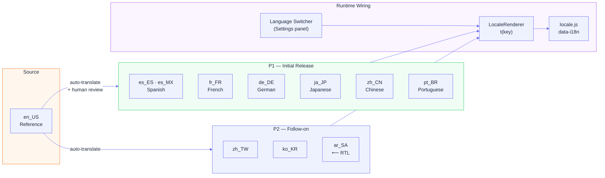

# Prism i18n Implementation Plan
**Status:** Draft

---

## 1. Target Markets

Selected by developer population size, enterprise IT adoption, and RTL/CJK complexity:

| Code | Language | Script | Priority | Notes |
|---|---|---|---|---|
| `en_US` | English (US) | LTR | P0 | Source / reference |
| `es_ES` | Spanish (Spain) | LTR | P1 | EU + LatAm coverage |
| `es_MX` | Spanish (Mexico) | LTR | P1 | Largest LatAm market |
| `fr_FR` | French (France) | LTR | P1 | EU + African enterprise |
| `de_DE` | German (Germany) | LTR | P1 | Largest EU tech market |
| `ja_JP` | Japanese | CJK | P1 | Major enterprise IT |
| `zh_CN` | Chinese Simplified | CJK | P1 | Largest developer pop |
| `zh_TW` | Chinese Traditional | CJK | P2 | Taiwan / HK |
| `pt_BR` | Portuguese (Brazil) | LTR | P1 | Large dev community |
| `ko_KR` | Korean | Hangul | P2 | Strong enterprise IT |
| `ar_SA` | Arabic | RTL | P2 | Gulf enterprise market |
| `hi_IN` | Hindi | Devanagari | P3 | Growing dev market |
| `ru_RU` | Russian | Cyrillic | P3 | Post-CIS dev market |
| `it_IT` | Italian | LTR | P3 | EU coverage |
| `nl_NL` | Dutch | LTR | P3 | EU coverage |

---

## 2. String Inventory

All strings currently inline in `install-ui.py` (HTML) and `installer_engine.py` (Python).

### UI strings (install-ui.py)
- Step titles: "Choose Your Prism", "Your Information", "Configuration Tiers", "Select Tools", etc.
- Button labels: "Next →", "← Back", "Install Now!", "Validate Configurations"
- Progress messages: "Setting up your environment...", "Starting installation..."
- Error messages: "Please select a prism!", "Connection failed"
- Success messages: "Installation complete!", "All Done!"
- Help text: "Required tools are pre-selected", "Connected to VPN"
- Settings labels: "Registry URL", "Custom unpkg CDN URL"
- Summary headings: "User Information", "Configuration Tiers", "Tools"

### Engine strings (installer_engine.py)
- Step log messages: "Homebrew already installed", "Installing Git...", "Cloned: {name}"
- Warning messages: "Skipping git config — no user info provided"
- Completion message from `step_finalize()`

### Package/prism strings (package_manager.py, package_validator.py)
- Validation error messages
- CLI output

---

## 3. Architecture



### Locale file format
Building on the existing `locales/en_US/ui.yaml` scaffold:

```
locales/
├── en_US/
│   ├── ui.yaml        # Web UI strings
│   └── engine.yaml    # Installer engine log messages
├── es_ES/
│   ├── ui.yaml
│   └── engine.yaml
├── de_DE/
...
```

Each file is a flat or lightly nested YAML with string keys:

```yaml
# locales/en_US/ui.yaml
steps:
  prism_selection: "Choose Your Prism"
  user_info: "Your Information"
  tiers: "Configuration Tiers"
  tools: "Select Tools"
  confirmation: "Ready to Refract!"
  installing: "Installing..."
  complete: "All Done!"

buttons:
  next: "Next →"
  back: "← Back"
  install: "Install Now!"
  validate: "Validate Configurations"
  close: "Close"

messages:
  select_prism: "Please select a prism!"
  installation_complete: "Installation complete! Your environment is ready."
  no_prisms_found: "No prisms found — add one to the prisms/ directory"
  required_tools_note: "Required tools are pre-selected"
  vpn_warning: "Make sure you are connected to VPN or company WiFi!"
  connection_success: "Connection successful!"
  connection_failed: "Connection failed"
  validating: "Validating..."
  loading: "Loading..."

summary:
  user_information: "User Information"
  configuration_tiers: "Configuration Tiers"
  tools: "Tools"
  no_tiers_selected: "No optional tiers selected (required tiers applied automatically)"
  no_tools_selected: "No tools selected"

errors:
  package_not_found: "Prism not found: {prism_id}"
  install_failed: "Installation failed: {error}"
  validation_failed: "Validation failed"
```

### Utility: `utilities/locale_renderer.py`

```python
class LocaleRenderer:
    def __init__(self, locale: str = "en_US"):
        self.locale = locale
        self._strings = self._load(locale)

    def t(self, key: str, **kwargs) -> str:
        """Translate key, interpolate kwargs."""
        ...

    def _load(self, locale: str) -> dict:
        """Load locale YAML, fall back to en_US for missing keys."""
        ...
```

### Web UI wiring
- Flask serves current locale to the frontend as JSON at `/api/locale`
- Accept-Language header + user preference (stored in browser localStorage)
- JS: `window._t = (key) => strings[key] || key`
- All hardcoded strings in HTML replaced with `data-i18n="key"` attributes
- `locale.js` runs on DOMContentLoaded, replaces all `data-i18n` text

### Engine wiring
- `InstallationEngine` receives locale from `user_info.get('locale', 'en_US')`
- Log messages use `self.renderer.t('engine.git.already_installed')`

### Language switcher
- Settings panel gains a "Language" dropdown listing all available locales
- Selection stored in localStorage, reloads page
- Also injectable as a URL param: `/?lang=de_DE`

---

## 4. Translation Approach

### Phase 1 — Automated baseline
Use Claude API to generate translations for all P1 locales:
- Input: `en_US/ui.yaml` + `en_US/engine.yaml`
- Output: one file per locale, marked `# AUTO-TRANSLATED — review needed`
- Script: `scripts/translate_locales.py --source en_US --targets es,fr,de,ja,zh,pt`

### Phase 2 — Human review
- Each file has a `_review_status` key: `auto | reviewed | approved`
- Community can submit PRs to improve translations
- CI check: all keys in locale must exist in `en_US` (no missing, no extra)

### Phase 3 — RTL and CJK
- Arabic requires `dir="rtl"` on `<html>` — detect from locale, inject dynamically
- CJK fonts: add `Noto Sans CJK` / `Noto Sans JP` to CSS for ja/zh locales

---

## 5. CI Validation

```
# In pytest or a dedicated script:
def test_all_locales_have_all_keys():
    en = load_yaml("locales/en_US/ui.yaml")
    for locale_dir in Path("locales").iterdir():
        if locale_dir.name == "en_US": continue
        locale_file = locale_dir / "ui.yaml"
        if not locale_file.exists(): continue
        translated = load_yaml(locale_file)
        missing = flat_keys(en) - flat_keys(translated)
        assert not missing, f"{locale_dir.name} missing keys: {missing}"
```

---

## 6. Prism-level i18n

Prism authors can provide translated strings in `package.yaml`:

```yaml
package:
  name: "my-company"
  description: "My Company Developer Setup"
  description_i18n:
    de_DE: "Meine Firma Entwickler-Setup"
    ja_JP: "マイカンパニー開発者セットアップ"
```

The UI shows the localized description when the user's locale matches.

---

## Progress

- [x] Locale scaffold exists (`locales/en_US/ui.yaml`)
- [ ] Complete `en_US/ui.yaml` with all strings
- [ ] Create `en_US/engine.yaml`
- [ ] Implement `utilities/locale_renderer.py`
- [ ] Wire `/api/locale` Flask endpoint
- [ ] Replace inline HTML strings with `data-i18n` attributes
- [ ] Implement `locale.js`
- [ ] Auto-translate P1 locales
- [ ] Add CI locale key coverage check
- [ ] RTL support for `ar_SA`
- [ ] Language switcher in settings panel
