# Prism UX Decomposition
**Status:** Draft
**Method:** Experiences > Flows > Interactions

---

## Decomposition Hierarchy

```mermaid
%%{init: {'theme': 'base', 'themeVariables': {'primaryColor': '#eef2ff', 'primaryTextColor': '#1e293b', 'primaryBorderColor': '#6366f1', 'lineColor': '#6366f1', 'secondaryColor': '#f0fdf4', 'tertiaryColor': '#faf5ff', 'background': '#ffffff', 'mainBkg': '#eef2ff', 'nodeBorder': '#6366f1', 'clusterBkg': '#f8faff', 'edgeLabelBackground': '#ffffff'}}}%%

flowchart TD
    subgraph experience["Experience — complete user journey, stable"]
        OE["OnboardingExperience"]
        AE["AuthoringExperience"]
        DE["DiscoveryExperience"]
    end

    subgraph flows["Flows — goal-directed sequences, moderately volatile"]
        F1["PrismSelectionFlow"]
        F2["UserInfoFlow"]
        F3["TierSelectionFlow"]
        F4["ToolSelectionFlow"]
        F5["ConfirmationFlow"]
        F6["InstallFlow"]
    end

    subgraph interactions["Interactions — atomic acts, most volatile"]
        I1["PrismCard"]
        I2["FormField"]
        I3["TierSelect"]
        I4["ToolCheckbox"]
        I5["SummaryBlock"]
        I6["LogLine"]
    end

    subgraph utilities["Utilities — cross-cutting, orthogonal"]
        U1["LocaleRenderer"]
        U2["ThemeApplicator"]
        U3["StepProgress"]
        U4["AlertBanner"]
    end

    OE --> F1 & F2 & F3 & F4 & F5 & F6
    F1 --> I1
    F2 --> I2
    F3 --> I3
    F4 --> I4
    F5 --> I5
    F6 --> I6

    F1 & F2 & F3 & F4 & F5 & F6 --> U1 & U2 & U3 & U4

    style experience fill:#faf5ff,stroke:#a855f7,color:#1e293b
    style flows fill:#eef2ff,stroke:#6366f1,color:#1e293b
    style interactions fill:#f0fdf4,stroke:#22c55e,color:#1e293b
    style utilities fill:#fff7ed,stroke:#f97316,color:#1e293b
```



This hierarchy maps directly to the VBD component model:
- **Experience** = Manager (orchestrates intent)
- **Flow** = Engine (executes a goal)
- **Interaction** = Resource Accessor (touches the interface)
- **Shared UI components** = Utilities (cross-cutting, reusable)

---

## Experiences

### X1: Onboarding Experience
*The complete journey of a developer getting their environment set up.*

Contains: F1 → F2 → F3 → F4 → F5 → F6 → F7
May embed: X2 (when they need to configure a custom registry)

### X2: Registry Configuration Experience
*Configuring a custom npm registry or CDN for enterprise environments.*

Stand-alone or embedded in X1 at step F1.

### X3: Prism Author Experience
*Creating, validating, and publishing a new prism.*

Contains: F8 → F9 → F10

### X4: Workspace Discovery Experience
*A developer exploring everything that was installed in their environment.*

Lives in the local docs server. Contains: F11 → F12

---

## Flows

### F1: Prism Selection Flow
**Goal:** User identifies and selects the prism that matches their organization.
**Entry:** App launch / step 1
**Exit:** Prism confirmed, theme applied, proceed to F2

| # | Interaction | Element | Notes |
|---|---|---|---|
| I1.1 | Observe prism list | Package grid | Cards show name, description, theme color |
| I1.2 | Filter prisms | Search input | Real-time filter by name/description |
| I1.3 | Select a prism | Package card click | Highlights card, applies theme gradient |
| I1.4 | Observe prism detail | Detail panel | Shows tiers, user fields count, type badge |
| I1.5 | Confirm selection | "Next →" button | Validates selection exists |

---

### F2: User Information Flow
**Goal:** Collect the user's profile fields as defined by the prism.
**Entry:** Post-prism selection
**Exit:** All required fields filled, proceed to F3

| # | Interaction | Element | Notes |
|---|---|---|---|
| I2.1 | Observe dynamic fields | `#userInfoFields` | Rendered from `/api/package/<name>/user-fields` |
| I2.2 | Input text field | `<input type="text">` | Name, employee ID, etc. |
| I2.3 | Input email field | `<input type="email">` | Validated format |
| I2.4 | Select dropdown | `<select>` | e.g., country, team |
| I2.5 | Input URL field | `<input type="url">` | GitHub profile, etc. |
| I2.6 | Check checkbox | `<input type="checkbox">` | Optional preferences |
| I2.7 | Observe validation error | Inline error message | Required field missing |
| I2.8 | Confirm and proceed | "Next →" button | |

---

### F3: Tier Selection Flow
**Goal:** User picks optional configuration layers (roles, teams, divisions, etc.).
**Entry:** Post-user-info
**Exit:** All desired tiers selected (zero or more), proceed to F4
**Skip condition:** Prism has no optional tiers → auto-advances to F4

| # | Interaction | Element | Notes |
|---|---|---|---|
| I3.1 | Observe tier list | `#prismTiersContainer` | Rendered from `/api/package/<name>/tiers` |
| I3.2 | Select a tier option | `<select>` per tier | e.g., "Platform Engineering" under "teams" |
| I3.3 | Observe tier description | Tooltip / inline text | Helps user understand what the tier adds |
| I3.4 | Deselect a tier | Set select to "(None)" | Removes from selectedSubPrisms |
| I3.5 | Confirm and proceed | "Next →" button | |

**Future: multi-select tiers**
| I3.6 | Check multiple options | Checkbox group per tier | For tiers that allow multiple selections |

---

### F4: Tool Selection Flow
**Goal:** User reviews and optionally adds tools beyond the required set.
**Entry:** Post-tier selection
**Exit:** Tool selection finalized, proceed to F5
**Skip condition:** Prism has no tools → auto-advances to F5

| # | Interaction | Element | Notes |
|---|---|---|---|
| I4.1 | Observe tool list | `#toolsList` | Required tools pre-checked and disabled |
| I4.2 | Check optional tool | `<input type="checkbox">` | Adds to install list |
| I4.3 | Uncheck optional tool | `<input type="checkbox">` | Removes from install list |
| I4.4 | Observe tool description | Inline label | Name + brief description |
| I4.5 | Confirm and proceed | "Next →" button | |

---

### F5: Confirmation Flow
**Goal:** User reviews their full setup before committing to installation.
**Entry:** Post-tool selection
**Exit:** User confirms → begins F6, or goes back

| # | Interaction | Element | Notes |
|---|---|---|---|
| I5.1 | Observe installation summary | `#summary` | Shows prism, user info, tiers, tools |
| I5.2 | Validate configurations | "Validate" button | Calls `/api/package/<name>/validate-configs` |
| I5.3 | Observe validation results | `#validationResults` | Success / warnings / errors shown |
| I5.4 | Observe VPN warning | Alert banner | Contextual reminder |
| I5.5 | Go back and change | "← Back" button | Returns to previous step |
| I5.6 | Commit to install | "Install Now!" button | Transitions to F6 |

---

### F6: Installation Progress Flow
**Goal:** User observes installation running and gets confidence it succeeded.
**Entry:** User clicked "Install Now!"
**Exit:** Install complete → F7, or error displayed

| # | Interaction | Element | Notes |
|---|---|---|---|
| I6.1 | Observe progress log | `#logOutput` | Step-by-step messages with color-coded levels |
| I6.2 | Observe spinner | CSS animation | Active during install |
| I6.3 | Observe install status | `#installStatus` | Text summary of current step |
| I6.4 | Observe success completion | Log + green message | "Installation complete!" |
| I6.5 | Observe error message | Red error text | With error detail |
| **Future** | Real-time streaming | SSE / WebSocket | Currently batch at end |

---

### F7: Completion Flow
**Goal:** User knows their environment is ready and what to do next.
**Entry:** Successful install
**Exit:** User closes, or navigates to docs server

| # | Interaction | Element | Notes |
|---|---|---|---|
| I7.1 | Observe success screen | Step 7 content | "All Done!" |
| I7.2 | Observe next steps | List of actions | Join Slack, add SSH key, etc. |
| I7.3 | Navigate to docs server | Link click | `http://localhost:8000` |
| I7.4 | Close installer | "Close" button | Closes browser tab |
| **Future** | Observe workspace overview | Embedded panel | What was installed |

---

### F8: Prism Creation Flow (Author Experience)
**Goal:** A prism author scaffolds a new prism from the CLI.
**Entry:** `python3 scripts/package_manager.py create my-company`

| # | Interaction | Element | Notes |
|---|---|---|---|
| I8.1 | Invoke CLI | Terminal | Provide name and `--company` |
| I8.2 | Observe generated files | Terminal output | Success message listing created files |
| I8.3 | Open generated `package.yaml` | Editor | Author fills in real content |
| I8.4 | Edit sub-prism YAML files | Editor | Populate `base/`, `teams/`, etc. |

---

### F9: Prism Validation Flow (Author Experience)
**Goal:** Author verifies their prism passes validation before publishing.

| # | Interaction | Element | Notes |
|---|---|---|---|
| I9.1 | Invoke validator | Terminal | `python3 scripts/package_validator.py prisms/my-company` |
| I9.2 | Observe validation output | Terminal | Valid / errors / warnings |
| I9.3 | Fix errors | Editor | Update `package.yaml` |
| I9.4 | Re-run validation | Terminal | Iterate until clean |

---

### F10: Prism Publishing Flow (Author Experience)
**Goal:** Author publishes a validated prism to npm.

| # | Interaction | Element | Notes |
|---|---|---|---|
| I10.1 | Dry-run publish | Terminal | `--dry-run` to preview |
| I10.2 | Confirm package.json exists | Filesystem | Required for npm publish |
| I10.3 | Publish | Terminal | `python3 scripts/publish_packages.py --package my-company` |
| I10.4 | Observe success / failure | Terminal | npm publish output |

---

### F11: Workspace Overview Flow (Discovery Experience)
**Goal:** Developer understands everything in their workspace at a glance.
**Entry:** Navigate to local docs server `http://localhost:8000`

| # | Interaction | Element | Notes |
|---|---|---|---|
| I11.1 | Observe workspace index | Browser page | Prism used, install date, platform |
| I11.2 | Browse tools list | Navigation | Each tool with version |
| I11.3 | Browse repos list | Navigation | Each repo with clone status |
| I11.4 | Browse merged config | YAML viewer | Full rendered merged-config.yaml |
| I11.5 | Navigate to prism docs | Link | Prism author's documentation |

---

### F12: Daily Discovery Flow
**Goal:** Developer finds something new in their environment.

| # | Interaction | Element | Notes |
|---|---|---|---|
| I12.1 | Observe "What's New" | Changelog panel | Repos added today, tools updated |
| I12.2 | Search workspace | Search bar | Find a tool, repo, or config value |
| I12.3 | View tool documentation | Tool detail page | Links to official docs |

---

## Shared Utilities / Components

These are used across multiple flows (like VBD Utilities — cross-cutting, no domain knowledge):

| Component | Used by | Description |
|---|---|---|
| `StepProgress` | All wizard flows | Progress bar + step indicator |
| `FormField` | F2 | Renders a user_info_field from schema |
| `TierSelect` | F3 | Renders one optional tier |
| `ToolCheckbox` | F4 | Renders one tool with required/optional state |
| `SummaryBlock` | F5 | Renders one section of the install summary |
| `LogLine` | F6 | Renders one progress log entry with level color |
| `AlertBanner` | F5, F6, F7 | Warning / info / error alert |
| `ValidationResult` | F5 | Shows validate-configs result |
| `ThemeApplicator` | F1 | Applies `data-theme` attribute to `<html>` |
| `LocaleRenderer` | All | `t(key)` lookup for i18n strings |
| `RegistrySettings` | X2 | npm registry + unpkg URL inputs |

---

## UX Principles

1. **Progressive disclosure** — each flow reveals only what's needed for that step
2. **Skip gracefully** — flows with no content (no tiers, no tools) are invisible to the user
3. **Never block on network** — all API calls degrade gracefully (show error, don't freeze)
4. **Contextual help** — every complex field has a subtitle or tooltip drawn from locale strings
5. **Visible system state** — the progress log in F6 should never leave the user wondering
6. **One primary action** — each step has exactly one "primary" button; back is always secondary

---

## Component File Structure (post-refactor)

```
ui/static/
├── index.html
├── css/
│   ├── base.css             # Reset, typography, layout
│   ├── themes.css           # Ocean, purple, forest, sunset, midnight
│   ├── wizard.css           # Step, progress bar, form layout
│   └── components.css       # Cards, alerts, checkboxes, log lines
└── js/
    ├── locale.js            # t(key) lookup, data-i18n replacement
    ├── theme.js             # ThemeApplicator
    ├── wizard.js            # Step navigation, getNextActiveStep, getPrevActiveStep
    ├── flows/
    │   ├── prism-selection.js   # F1
    │   ├── user-info.js         # F2
    │   ├── tiers.js             # F3
    │   ├── tools.js             # F4
    │   ├── confirmation.js      # F5
    │   └── install.js           # F6 + F7
    └── components/
        ├── form-field.js
        ├── tier-select.js
        ├── tool-checkbox.js
        ├── summary-block.js
        ├── log-line.js
        └── alert-banner.js
```
