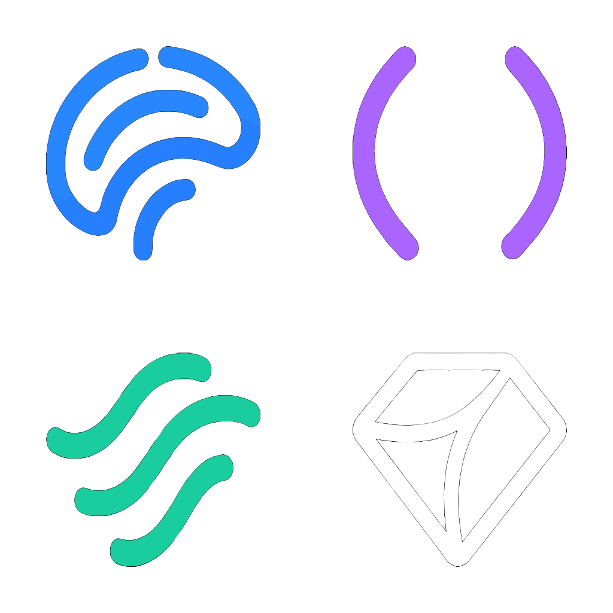

<p align="center">
  
</p>

<h1 align="center">Prism</h1>
<p align="center"><strong>Refract complexity into clarity</strong></p>
<p align="center"><em>Configuration inheritance system for managing multi-level development environments</em></p>

<p align="center">
  <a href="https://opensource.org/licenses/MIT"></a>
  <a href="https://www.python.org/downloads/"></a>
  
</p>

---

## What is Prism?

Prism is a **configuration inheritance system** that manages complex, multi-level development environments through composable YAML configurations. Like a prism refracts white light into distinct colors, Prism takes organizational complexity and refracts it into clear, manageable configuration layers.

### The Problem

Large organizations face configuration chaos:

- **Complex hierarchies** — Fortune 500 companies with 5+ organizational levels
- **Conflicting requirements** — Different teams need different tools, configs, and access
- **Configuration drift** — No single source of truth across thousands of employees
- **Onboarding friction** — New hires waste days configuring their environment

### The Solution

Prism provides:

- **Configuration inheritance** — Define once at company level, override per team
- **Multi-level hierarchies** — Support structures from flat (startups) to 5+ levels (enterprise)
- **Web UI** — Visual prism selection and installation wizard
- **CLI tools** — Scriptable, automatable, CI/CD friendly
- **NPM distribution** — Packages published to npm, no custom infrastructure needed
- **Validation** — Catch errors before deployment
- **Smart merging** — Deep-merge with list handling strategies

---

## Quick Start

### Installation

```bash
# Clone the repository
git clone https://github.com/andersonwilliam85/prism.git
cd prism

# Install dependencies
make install-dev

# Run tests
make test

# Start the web UI installer
make run
# Opens at http://localhost:5555
```

### Create Your First Configuration

```bash
# Use a template as starting point
cp -r prisms/acme-corp prisms/my-company

# Edit the base configuration
vim prisms/my-company/base/my-company.yaml

# Validate
python3 scripts/package_validator.py prisms/my-company
```

See [Creating Configurations](docs/user-guide/creating-configurations.md) for a detailed guide.

---

## Features

### Web UI Installer

- Prism gallery with visual cards for all configurations
- Step-by-step wizard with progress tracking
- Theme system (5 themes with localStorage persistence)
- Responsive design
- Smart validation prevents configuration errors

```bash
python3 install-ui.py
# or
make run
```

### Configuration Inheritance

Multi-level hierarchy support:

```
Company (base)
  └── Business Unit
      └── Department
          └── Team
              └── Individual
```

Configurations merge intelligently — base layer defines company standards, each level can override or extend. See [Config Inheritance](docs/user-guide/config-inheritance.md).

### Built-in Prisms

| Prism | Use Case | Hierarchy | Scale |
|-------|----------|-----------|-------|
| `prism` | Default out-of-box | Flat | Any |
| `personal-dev` | Freelancers, indie devs | Flat | 1 |
| `startup` | Seed/Series A startups | 1 level | 10–50 |
| `acme-corp` | Template for companies | 2 levels | 100–1K |
| `consulting-firm` | Multi-client work | By client | Variable |
| `fortune500` | Enterprise | 5 levels | 50K+ |
| `university` | Academic institutions | Dept to Lab | Variable |
| `opensource` | Community projects | Flat | Community |

### NPM Distribution

```bash
# Packages auto-fetch from npm via unpkg CDN
python3 install.py --prism personal-dev

# Use custom registry (corporate/air-gapped)
python3 install.py --npm-registry https://npm.mycompany.com
```

### Validation

```bash
# Validate single package
python3 scripts/package_validator.py prisms/my-company

# Validate all packages
python3 scripts/package_validator.py --all
```

---

## Architecture

```
prism/
├── install-ui.py              # Web UI server (Flask)
├── install.py                 # CLI installer
├── installer_engine.py        # Core installation logic
├── scripts/
│   ├── config_merger.py       # Configuration inheritance engine
│   ├── config_validator.py    # YAML validation
│   ├── package_validator.py   # Package schema validation
│   ├── package_manager.py     # Package operations
│   └── npm_package_fetcher.py # NPM integration
├── prisms/                    # Prism configurations
│   ├── prism.prism/           # Default product prism
│   ├── personal-dev/
│   ├── startup.prism/
│   ├── acme-corp/
│   └── ...
└── tests/
    ├── unit/
    ├── e2e/
    └── integration/
```

---

## Development

### Prerequisites

- Python 3.9+
- Flask (for web UI)

### Setup

```bash
make install-dev    # Install dev dependencies
make test           # Run tests
make run            # Start dev server
make lint           # Run linters
make format         # Format code
make check          # All CI checks
```

---

## Testing

```bash
make test              # Unit + CLI tests
make test-all          # All tests including E2E
make test-coverage     # With coverage report
```

GitHub Actions runs lint, test, and coverage on every PR.

---

## Supported Platforms

- **macOS** (Intel and Apple Silicon)
- **Windows** 10/11
- **Linux** (Ubuntu 20.04+, Debian, Fedora, RHEL)

---

## Contributing

1. Fork the repository
2. Create a feature branch: `git checkout -b feature/my-feature`
3. Make changes and test: `make test-all`
4. Format code: `make format`
5. Run CI checks: `make check`
6. Submit a Pull Request

See [Contributing Guide](docs/contributor-guide/contributing.md).

---

## Part of the Neural Platform

<p align="center">
  
</p>

Prism is part of the **Neural Platform** — a suite of tools for developer productivity and agent coordination:

- **Prism** — Developer onboarding and configuration inheritance
- **Cortex** — Agent runtime and orchestration
- **Synapse** — Shared coordination state
- **Axon** — GitHub event bridge

---

## License

MIT License — See [LICENSE](LICENSE)

Copyright (c) 2025 William Anderson

---

<p align="center">
  <strong>Prism — Refract complexity into clarity</strong><br>
  Made by <a href="https://github.com/andersonwilliam85">William Anderson</a>
</p>
