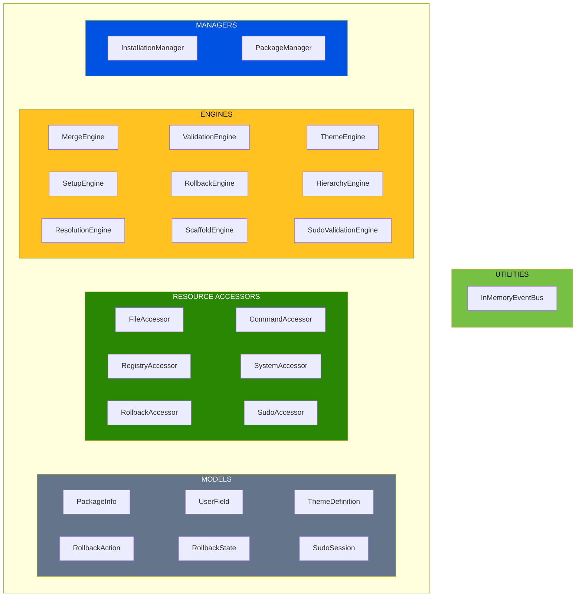
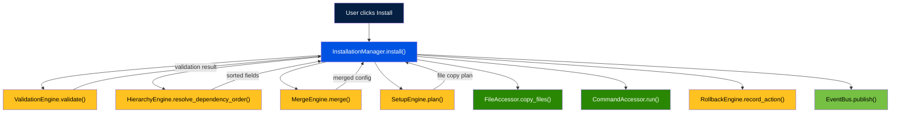

# Architecture

Prism follows a VBD-inspired (Volatility-Based Decomposition) layered architecture. Each layer has a single responsibility and a defined volatility profile. Dependencies flow inward — outer layers depend on inner layers, never the reverse.

---

## Layer Overview

### Figure 1: VBD Layer Architecture



---

## Layer Responsibilities

### Managers

Orchestrate multi-step workflows by coordinating engines and accessors. Managers contain no business logic and no I/O — they delegate both.

| Manager | Responsibility |
|---|---|
| `InstallationManager` | Orchestrates the full install flow: validation, merge, setup, command execution |
| `PackageManager` | Package discovery, listing, validation, and scaffold creation |

### Engines

Pure computation. No file system access, no network calls, no subprocess invocations. Given inputs, they return outputs. This makes them trivially testable and highly stable.

| Engine | Responsibility |
|---|---|
| `MergeEngine` | Deep-merges sub-prism configurations using strategy rules |
| `ValidationEngine` | Validates `package.yaml` structure and field constraints |
| `ThemeEngine` | Resolves, lists, and validates themes (5 built-in + custom) |
| `SetupEngine` | Computes file copy plans from `setup` config |
| `RollbackEngine` | Tracks actions, computes LIFO undo sequences |
| `HierarchyEngine` | Resolves cascading field dependencies via topological sort |
| `ResolutionEngine` | Resolves prism sources (local, remote, npm) |
| `ScaffoldEngine` | Generates new prism directory scaffolds |
| `SudoValidationEngine` | Manages sudo sessions: tokens, TTL, lockout |

### Accessors

I/O boundary. Each accessor wraps exactly one external dependency (filesystem, subprocess, network). They are thin adapters — no business logic.

| Accessor | Responsibility |
|---|---|
| `FileAccessor` | File and directory read/write/copy operations |
| `CommandAccessor` | Subprocess execution (tool installs, git config) |
| `RegistryAccessor` | HTTP requests to npm/unpkg registries |
| `SystemAccessor` | Platform detection, environment variables |
| `RollbackAccessor` | Rollback state persistence (JSON temp files), rollback execution |
| `SudoAccessor` | Sudo password validation via `sudo -S -v` |

### Utilities

Cross-cutting services shared across layers.

| Utility | Responsibility |
|---|---|
| `InMemoryEventBus` | Publish/subscribe event system for progress reporting |

### Models

Plain data classes (Python dataclasses). No behavior beyond property accessors. Used by all layers.

| Model | Responsibility |
|---|---|
| `PackageInfo` | Parsed `package.yaml` — identity, config, tiers |
| `UserField` | A single `user_info_fields` entry with type, validation, dependencies |
| `ThemeDefinition` | Theme ID, name, and 5 gradient color slots |
| `RollbackAction` | A tracked install action (type, target, rollback command) |
| `RollbackState` | All actions for one installation, supports LIFO undo |
| `SudoSession` | Token, TTL, attempt counter, lockout state |

---

## Dependency Injection

All wiring happens in `container.py` — the composition root. It is the **only** file that imports concrete classes. Every other module depends on interfaces (abstract base classes), not implementations.

```python
# container.py — simplified
class Container:
    def __init__(self, prisms_dir):
        # Engines (no dependencies)
        self.merge_engine = MergeEngine()
        self.validation_engine = ValidationEngine()
        self.theme_engine = ThemeEngine()
        # ...

        # Accessors (no dependencies)
        self.file_accessor = FileAccessor()
        self.command_accessor = CommandAccessor()
        # ...

        # Managers (depend on engines + accessors)
        self.installation_manager = InstallationManager(
            merge_engine=self.merge_engine,
            setup_engine=self.setup_engine,
            validation_engine=self.validation_engine,
            command_accessor=self.command_accessor,
            file_accessor=self.file_accessor,
            system_accessor=self.system_accessor,
            event_bus=self.event_bus,
            prisms_dir=prisms_dir,
        )
```

To swap an implementation (e.g., for testing), replace the concrete class in `container.py` or inject a mock via the constructor.

---

## Data Flow

A typical installation follows this path:

### Figure 2: Installation Data Flow



---

## Design Principles

1. **Engines are pure** — No I/O, no side effects. Given the same input, always the same output.
2. **Accessors are thin** — Wrap exactly one external dependency. No business logic.
3. **Managers orchestrate** — They call engines for decisions and accessors for actions.
4. **Models are data** — Plain dataclasses. No behavior beyond computed properties.
5. **Dependencies flow inward** — Managers → Engines/Accessors → Models. Never the reverse.
6. **One composition root** — `container.py` is the only file that knows concrete types.

---

## File Structure

```
prism/
├── container.py                 # Composition root (DI wiring)
├── managers/
│   ├── installation_manager/
│   └── package_manager/
├── engines/
│   ├── merge_engine/
│   ├── validation_engine/
│   ├── theme_engine/
│   ├── setup_engine/
│   ├── rollback_engine/
│   ├── hierarchy_engine/
│   ├── resolution_engine/
│   ├── scaffold_engine/
│   └── sudo_validation_engine/
├── accessors/
│   ├── file_accessor/
│   ├── command_accessor/
│   ├── registry_accessor/
│   ├── system_accessor/
│   ├── rollback_accessor/
│   └── sudo_accessor/
├── utilities/
│   └── event_bus/
└── models/
    ├── installation.py
    ├── package_info.py
    └── prism_config.py
```

---

## See Also

- [Rollback System](rollback-system.md) — How RollbackEngine and RollbackAccessor work together
- [Privilege Separation](privilege-separation.md) — SudoValidationEngine and SudoAccessor
- [Configuration Schema](configuration-schema.md) — The data that flows through these layers
- [Contributing](../contributor-guide/contributing.md) — Development setup and conventions
