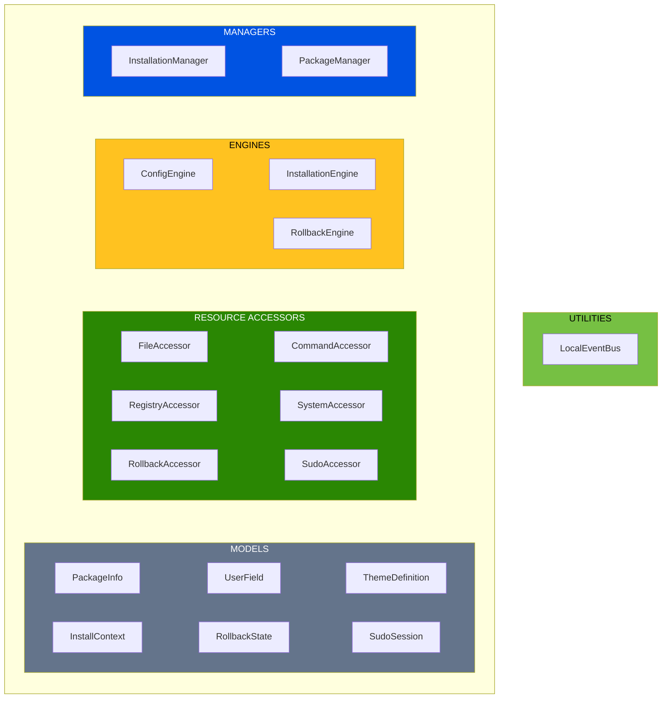
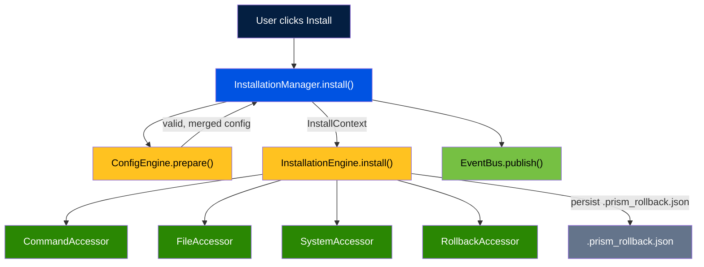

# Architecture

Prism follows a VBD-inspired (Volatility-Based Decomposition) layered architecture. Each component is grouped by its volatility axis — what causes it to change. Dependencies flow inward, and all wiring happens in a single composition root.

---

## Layer Overview

### Figure 1: VBD Layer Architecture



---

## Layer Responsibilities

### Managers

Orchestrate workflows by collecting context and delegating to engines. Managers own the "what" — which package, which sub-prisms, which events to publish.

| Manager | Responsibility |
|---|---|
| `InstallationManager` | Loads config, validates/merges via ConfigEngine, delegates execution to InstallationEngine, publishes events |
| `PackageManager` | Package discovery, listing, validation (via ConfigEngine), user field resolution |

### Engines

Encapsulate the "how" — business logic grouped by volatility axis. Engines receive accessors via constructor injection and handle full execution internally, including I/O through accessors.

| Engine | Volatility Axis | Public Interface |
|---|---|---|
| `ConfigEngine` | Schema evolution (medium-high) | `validate()`, `prepare()`, `merge()`, `merge_tiers()`, hierarchy methods |
| `InstallationEngine` | Installation surface (low-medium) | `install()`, `rollback()`, `install_privileged()`, sudo session management |
| `RollbackEngine` | Rollback execution | `find_manifest()`, `load_manifest()`, `execute_rollback()` |

**ConfigEngine** owns config validation, merge strategies, and field hierarchy resolution. It validates the tool registry (every tool must have install + uninstall commands), validates that tool references in sub-prism configs exist in the registry, and validates email patterns from YAML.

**InstallationEngine** owns the full installation pipeline: preflight checks, git config, workspace creation, repo cloning, tool installation, config file copying, rollback manifest persistence, and sudo sessions. The UI sends `toolsSelected` from checkboxes — only checked tools get installed. `tools_selected=[]` means nothing is installed. Subprocesses have timeouts and `GIT_TERMINAL_PROMPT=0`.

**RollbackEngine** (`prism/engines/rollback_engine.py`) handles rollback execution. It is shared by the CLI (`prism rollback`) and the API (`/api/rollback`). Installs persist a `.prism_rollback.json` manifest; `prism rollback <workspace>` reverses all recorded actions.

### Accessors

Encapsulate the "where" — external boundaries. Each accessor wraps exactly one external dependency (filesystem, APIs, registries, subprocesses). No business logic.

| Accessor | Responsibility |
|---|---|
| `FileAccessor` | File and directory read/write/copy, YAML I/O, package discovery |
| `CommandAccessor` | Git commands, SSH key generation, package manager CLI |
| `RegistryAccessor` | HTTP requests to npm/unpkg registries |
| `SystemAccessor` | Platform detection, environment variables, installed versions |
| `RollbackAccessor` | Rollback state persistence, file/directory deletion, command execution |
| `SudoAccessor` | Sudo password validation via `sudo -S -v` |

### Utilities

Cross-cutting services shared across layers.

| Utility | Responsibility |
|---|---|
| `LocalEventBus` | Publish/subscribe event system for manager-to-manager communication |

### Models

Plain data classes (Python dataclasses). No behavior beyond property accessors.

| Model | Responsibility |
|---|---|
| `PackageInfo` | Parsed `package.yaml` — identity, config, tiers |
| `UserField` | A single `user_info_fields` entry with type, validation, dependencies |
| `ThemeDefinition` | Theme ID, name, and gradient color slots |
| `InstallContext` | Everything the InstallationEngine needs to execute an install |
| `RollbackState` | All actions for one installation, supports LIFO undo |
| `SudoSession` | Token, TTL, attempt counter, lockout state |

---

## Dependency Injection

All wiring happens in `container.py` — the composition root. It is the **only** file that imports concrete classes. Every other module depends on interfaces (`Protocol` classes), not implementations.

```python
# container.py — simplified
class Container:
    def __init__(self, prisms_dir):
        # Utilities
        self.event_bus = LocalEventBus()

        # Engines (InstallationEngine receives accessors)
        self.config_engine = ConfigEngine()
        self.installation_engine = InstallationEngine(
            command_accessor=CommandAccessor(),
            file_accessor=FileAccessor(),
            system_accessor=SystemAccessor(),
            rollback_accessor=RollbackAccessor(),
        )

        # Managers (depend on engines + utilities)
        self.installation_manager = InstallationManager(
            config_engine=self.config_engine,
            installation_engine=self.installation_engine,
            file_accessor=FileAccessor(),
            system_accessor=SystemAccessor(),
            event_bus=self.event_bus,
            prisms_dir=prisms_dir,
        )
```

To swap an implementation (e.g., for testing), replace the concrete class in `container.py` or inject a mock via the constructor.

---

## Data Flow

### Figure 2: Installation Data Flow



---

## Tool Registry

Tools are defined in a centralized `tool-registry.yaml` file. Each tool has:

- **label** — display name (shown in UI)
- **summary** — short tagline (always visible next to label)
- **description** — full explanation (shown on hover in UI)
- **category** — grouping key (core, editor, containers, runtime, cloud, kubernetes, cli)
- **platforms** — explicit install commands per OS (mac, ubuntu, linux, windows)
- **uninstall** — explicit uninstall commands per OS (used by rollback)

Child configs reference tools by string name only (e.g., `- git`). The ConfigEngine validates that tool references exist in the registry and that every tool has both install and uninstall commands. Tools without explicit platform install commands for the current OS are skipped — no generic fallbacks.

---

## Design Principles

1. **Engines own the "how"** — They encapsulate full execution, calling accessors internally for both reads and writes.
2. **Managers own the "what"** — They collect context, delegate to engines, and publish events. They don't know about individual steps.
3. **Accessors are thin** — Wrap exactly one external dependency. No business logic.
4. **Models are data** — Plain dataclasses. No behavior beyond computed properties.
5. **Coarse-grained interfaces** — Engines expose few public operations. Fine-grained logic stays private.
6. **One composition root** — `container.py` is the only file that knows concrete types.
7. **Volatility-based grouping** — Components that change for the same reason live together.
8. **No generic fallbacks** — Tools without explicit platform install commands are skipped.

---

## File Structure

```
prism/
+-- container.py                 # Composition root (DI wiring)
+-- managers/
|   +-- installation_manager/
|   +-- package_manager/
+-- engines/
|   +-- config_engine/           # Schema evolution axis
|   +-- installation_engine/     # Installation surface axis
|   +-- rollback_engine.py       # Rollback execution (shared by CLI and API)
+-- accessors/
|   +-- file_accessor/
|   +-- command_accessor/
|   +-- registry_accessor/
|   +-- system_accessor/
|   +-- rollback_accessor/
|   +-- sudo_accessor/
+-- cli/
|   +-- install.py
|   +-- rollback.py              # prism rollback CLI command
|   +-- history.py               # prism history CLI command
|   +-- packages.py
|   +-- ui.py
+-- ui/
|   +-- api/
|   +-- templates/
+-- utilities/
|   +-- event_bus/
+-- models/
|   +-- installation.py
|   +-- package_info.py
|   +-- prism_config.py
+-- tools/
    +-- docs_server/
```

---

## See Also

- [Rollback System](rollback-system.md) — How rollback tracking and execution works
- [Privilege Separation](privilege-separation.md) — Sudo session management
- [Configuration Schema](configuration-schema.md) — The data that flows through these layers
- [Contributing](../contributor-guide/contributing.md) — Development setup and conventions
