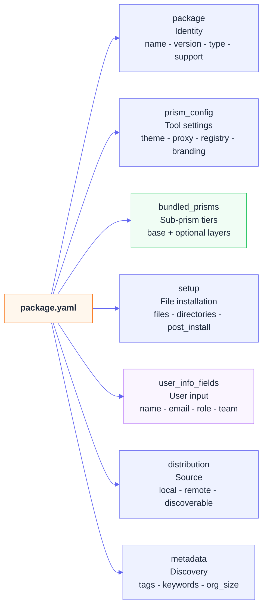

# Prism Configuration Schema

Complete YAML schema reference for `package.yaml` — the manifest for every prism.

---

## Overview

Every prism lives in its own directory inside `prisms/` and must have a `package.yaml` file. The schema has seven top-level sections:



```yaml
package:          # Identity — name, version, type, support
prism_config:     # Prism tool settings — theme, proxy, registry, branding
bundled_prisms:   # Hierarchical sub-prisms — base + optional tiers
setup:            # File installation steps
user_info_fields: # Info collected from the user at install time
distribution:     # Where this prism is sourced from
metadata:         # Tags, keywords, company size
```

In addition, each prism's base directory contains a `tool-registry.yaml` file — the centralized tool registry. See [Prism System](package-system.md) for details.

---

## `package` — Identity

### Required

```yaml
package:
  name: "my-company-prism"    # kebab-case identifier
  version: "1.0.0"            # semantic version
  description: "..."          # one-sentence description
```

### Optional

```yaml
package:
  type: "company"             # personal | company | consulting | enterprise | academic | opensource | core
  author: "IT Team"
  homepage: "https://dev.mycompany.com"

  support:
    email: "devops@mycompany.com"
    slack: "#dev-support"
    github: "https://github.com/org/repo/issues"

  requires:
    onboarding_version: ">=1.0.0"
    python_version: ">=3.8"
    network: "company-vpn"    # optional — warn user if not met
```

---

## `prism_config` — Prism Tool Settings

Controls how the Prism tool itself behaves. Applied before any sub-prism merging.

```yaml
prism_config:
  theme: "ocean"    # ocean | purple | forest | sunset | midnight

  sources:
    - url: "local"
      name: "Built-in Prisms"
      type: "local"
    - url: "https://prism-registry.mycompany.com"
      name: "Internal Registry"
      type: "remote"
      auth_required: true

  npm_registry: "https://npm.mycompany.com"   # empty = npmjs.org
  unpkg_url: "https://cdn.mycompany.com/npm"  # empty = unpkg.com

  proxies:
    http: "http://proxy.mycompany.com:8080"
    https: "http://proxy.mycompany.com:8080"
    no_proxy: "localhost,127.0.0.1,.mycompany.com"

  branding:
    name: "My Company Prism"
    tagline: "Empowering [Company] Development"
    logo_url: "https://mycompany.com/assets/logo.svg"
    primary_color: "#1e3a8a"    # hex color
    secondary_color: "#f59e0b"
```

---

## `bundled_prisms` — Hierarchical Sub-Prisms

The heart of the inheritance system. Each key is a **tier** — a category of selectable sub-prisms. Tiers are merged in declaration order.

```yaml
bundled_prisms:
  # Base tier — REQUIRED sub-prisms, always applied
  base:
    - id: "company-base"
      name: "Company Base"
      description: "Company-wide settings"
      required: true                  # marks this as auto-applied
      config: "base/company.yaml"     # path relative to prism directory

  # Example optional tier — user picks one
  divisions:
    - id: "technology"
      name: "Technology Division"
      description: "IT and software engineering"
      config: "divisions/technology.yaml"

    - id: "digital"
      name: "Digital Division"
      config: "divisions/digital.yaml"

  # Another optional tier
  roles:
    - id: "software-engineer"
      name: "Software Engineer"
      config: "roles/software-engineer.yaml"
      tools:                          # informational — shown in UI
        - docker
        - kubernetes

  # Optional multi-select tier
  business_units:
    - id: "retail"
      name: "Retail Division"
      config: "business_units/retail.yaml"
```

### Sub-prism config file structure

Each config file referenced by `bundled_prisms` is plain YAML. Any keys it contains are deep-merged into the final configuration. Tools are referenced by name only — they must exist in the `tool-registry.yaml`:

```yaml
# base/company.yaml
environment:
  proxy:
    http: "http://proxy.mycompany.com:8080"
  vpn:
    required: true

git:
  user:
    name: "${USER}"
    email: "${USER}@mycompany.com"

tools_required:
  - git
  - docker
  - kubectl

security:
  sso_required: true
  mfa_required: true
```

```yaml
# roles/devops-engineer.yaml
role:
  id: "devops-engineer"
  name: "DevOps Engineer"

tools_required:
  - terraform
  - ansible
  - helm

repositories:
  - name: "infrastructure"
    url: "https://github.mycompany.com/platform/infrastructure"
```

---

## `setup` — File Installation

Controls which files are copied from the prism directory to `config/` when the prism is installed.

```yaml
setup:
  install:
    target_dir: "config/"

    files:
      - source: "welcome.yaml"
        dest: "config/welcome.yaml"
        description: "Welcome message"

      - source: "resources.yaml"
        dest: "config/resources.yaml"

    directories:
      - source: "base/"
        dest: "config/base/"
      - source: "roles/"
        dest: "config/roles/"

  post_install:
    message: |
      Prism installed!
      Next steps: ...
```

---

## `user_info_fields` — User Input

Defines what information to collect from the user during installation.

### Text input

```yaml
user_info_fields:
  - id: "name"
    label: "Full Name"
    type: "text"
    required: true
    placeholder: "Jane Developer"
    description: "Used for git commits"
```

### Email input

```yaml
  - id: "email"
    label: "Company Email"
    type: "email"
    required: true
    placeholder: "jane@mycompany.com"
    validation:
      pattern: ".*@mycompany\\.com$"
      message: "Must be a @mycompany.com email"
```

The config engine validates email patterns from YAML — patterns defined in `validation.pattern` are checked at install time.

### Select dropdown

```yaml
  - id: "role"
    label: "Role"
    type: "select"
    required: true
    options:
      - "Software Engineer"
      - "DevOps Engineer"
      - "Data Engineer"
```

### URL input

```yaml
  - id: "portfolio_url"
    label: "Portfolio URL"
    type: "url"
    required: false
    placeholder: "https://janedev.com"
```

### Number input

```yaml
  - id: "employee_id"
    label: "Employee ID"
    type: "number"
    required: true
    min: 100000
    max: 999999
```

### Checkbox

```yaml
  - id: "agree_to_terms"
    label: "I agree to the terms"
    type: "checkbox"
    required: true
```

---

## `distribution` — Where the Prism Lives

```yaml
distribution:
  local:
    path: "prisms/my-company/"
    discoverable: true    # false = hidden from list

  git:
    url: "https://github.com/mycompany/prism-config"
    branch: "main"

  internal:
    url: "https://prism-registry.mycompany.com/my-company"
    auth_required: true
```

---

## `metadata` — Tags and Search

```yaml
metadata:
  tags:
    - company
    - template
    - enterprise

  keywords:
    - my-company
    - onboarding

  company_size: "medium"    # personal | small | medium | large | enterprise | academic | community

  regions: ["Global", "US", "EU"]

  security:
    classification: "internal-use-only"
    compliance:
      - sox
      - gdpr
      - hipaa

  last_updated: "2026-03-05"
  maintainers:
    - "DevOps Team"
```

---

## Minimal Complete Example

```yaml
package:
  name: "my-company-prism"
  version: "1.0.0"
  description: "My Company developer environment"
  type: "company"

prism_config:
  theme: "midnight"
  branding:
    name: "My Company Prism"
    primary_color: "#1e3a8a"

bundled_prisms:
  base:
    - id: "base"
      name: "My Company Base"
      required: true
      config: "base/my-company.yaml"

  teams:
    - id: "platform"
      name: "Platform Team"
      config: "teams/platform.yaml"

setup:
  install:
    target_dir: "config/"
    files:
      - source: "welcome.yaml"
        dest: "config/welcome.yaml"
    directories:
      - source: "base/"
        dest: "config/base/"

user_info_fields:
  - id: "name"
    label: "Full Name"
    type: "text"
    required: true
  - id: "email"
    label: "Email"
    type: "email"
    required: true

distribution:
  local:
    path: "prisms/my-company/"
    discoverable: true

metadata:
  tags: ["company", "template"]
  company_size: "medium"
  last_updated: "2026-03-05"
```

---

## Validation

```bash
# Validate a single prism
prism packages validate my-company

# Validate all prisms
prism packages validate
```

The config engine validates:
- `package.yaml` exists and is valid YAML
- Required fields: `package.name`, `package.version`, `package.description`
- `bundled_prisms` entries have `id` and `config` fields
- `user_info_fields` entries have `id`, `label`, and `type` fields
- Field types are valid: text, email, url, select, number, checkbox
- `prism_config.theme` is a string
- Tool registry entries have `platforms` (install) and `uninstall` commands
- Tool references in sub-prism configs exist in the tool registry
- Email validation patterns are valid

### Common Errors

**`Missing required field: package.name`**
```yaml
# Fix: add package.name
package:
  name: "my-prism"
```

**`Sub-prism config not found: roles/engineer.yaml`**
```bash
# Fix: create the referenced file
touch prisms/my-company.prism/roles/engineer.yaml
```

**`Unknown theme 'blue'`**
```yaml
# Fix: use a supported theme
prism_config:
  theme: "ocean"   # ocean | purple | forest | sunset | midnight
```

**`tool_registry.docker has no uninstall commands`**
```yaml
# Fix: add uninstall commands for each platform
docker:
  platforms:
    mac: brew install --cask docker
  uninstall:
    mac: brew uninstall --cask docker
```

---

## Resources

- [Sub-Prism Inheritance](../user-guide/config-inheritance.md)
- [Choosing a Prism](../getting-started/choosing-a-prism.md)
- [Creating Prisms](../user-guide/creating-configurations.md)
- [Prism System](package-system.md) — Tool registry and CLI reference
