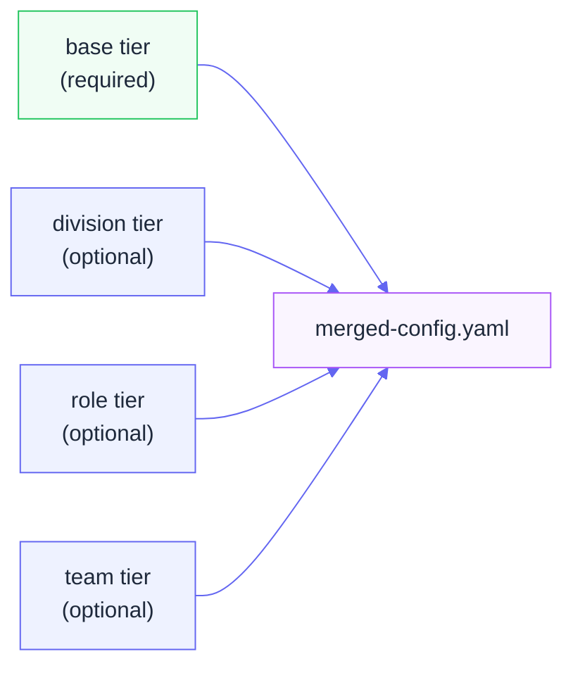

# Merge Strategies

When a user selects optional tiers (teams, roles, divisions), Prism merges their configuration files into a single resolved config. This page documents exactly how that merge works — which keys win, which accumulate, and which are replaced.

---

## Overview



Tiers are applied in order: `base` first, then each selected optional tier in the order they were applied. Later tiers extend — they don't erase — what came before, except where an override strategy applies.

---

## Tool Selection Fields

Each sub-prism YAML can specify three tool-related lists:

| Field | Type | Meaning |
|---|---|---|
| `tools_required` | list | Tools that must be installed |
| `tools_selected` | list | Tools added to the install list by this tier |
| `tools_excluded` | list | Tools suppressed from the install list |

### Merge behavior: union

`tools_required` and `tools_selected` are merged by **union** — a tool listed in any tier ends up in the install list. Duplicates are collapsed.

```yaml
# base tier
tools_required: [git, brew, nvm]

# platform-engineering tier
tools_required: [kubectl, helm]

# Merged result
tools_required: [git, brew, nvm, kubectl, helm]
```

### tools_excluded takes precedence

If a tool appears in `tools_excluded` in any tier, it is removed from the final install list regardless of other tiers requiring it.

```yaml
# base tier
tools_required: [slack]

# security tier
tools_excluded: [slack]  # corporate policy: no Slack on security team

# Merged result: slack is NOT installed
```

---

## Other Section Strategies

| Section | Strategy | Description |
|---|---|---|
| `tools_required` | union | Any tier can add tools |
| `tools_selected` | union | Additive across all tiers |
| `tools_excluded` | union (removes) | Any tier can suppress a tool |
| `resources` | append | Lists concatenate — all resources from all tiers |
| `onboarding_tasks` | append | All tasks accumulate |
| `environment` | deep_merge | Nested dicts merge; leaf values from later tiers win |
| `git` | override | Later tier replaces the entire `git` section |
| `career` | user_only | Ignored during merge; sourced from `user-info.yaml` |

---

## Deep Merge Example

`environment` uses deep merge, meaning nested structure is preserved:

```yaml
# base tier
environment:
  proxy:
    http: "http://proxy.company.com:8080"
  shell: bash

# platform-engineering tier
environment:
  proxy:
    no_proxy: "localhost,127.0.0.1"
  editor: nvim

# Merged result
environment:
  proxy:
    http: "http://proxy.company.com:8080"
    no_proxy: "localhost,127.0.0.1"
  shell: bash
  editor: nvim
```

---

## Override Example

`git` uses override — the entire section from the last tier that defines it wins:

```yaml
# base tier
git:
  default_branch: main
  signing: false

# security tier
git:
  default_branch: main
  signing: true
  gpg_key: "ABC123"

# Merged result: security tier's git block completely replaces base
git:
  default_branch: main
  signing: true
  gpg_key: "ABC123"
```

---

## Implementation

The merge logic lives in `scripts/config_merger.py` — `ConfigMerger.merge_configs()`. To inspect a merged result without running an install:

```bash
python3 -c "
from scripts.config_merger import ConfigMerger
merger = ConfigMerger()
result = merger.merge_configs(['prisms/my-company/base', 'prisms/my-company/platform-eng'])
import yaml; print(yaml.dump(result, default_flow_style=False))
"
```

---

## See Also

- [Sub-Prism Inheritance](../user-guide/config-inheritance.md) — Visual guide to tier hierarchy
- [Configuration Schema](configuration-schema.md) — Full `package.yaml` reference
- [Creating Configurations](../user-guide/creating-configurations.md) — Authoring a prism
