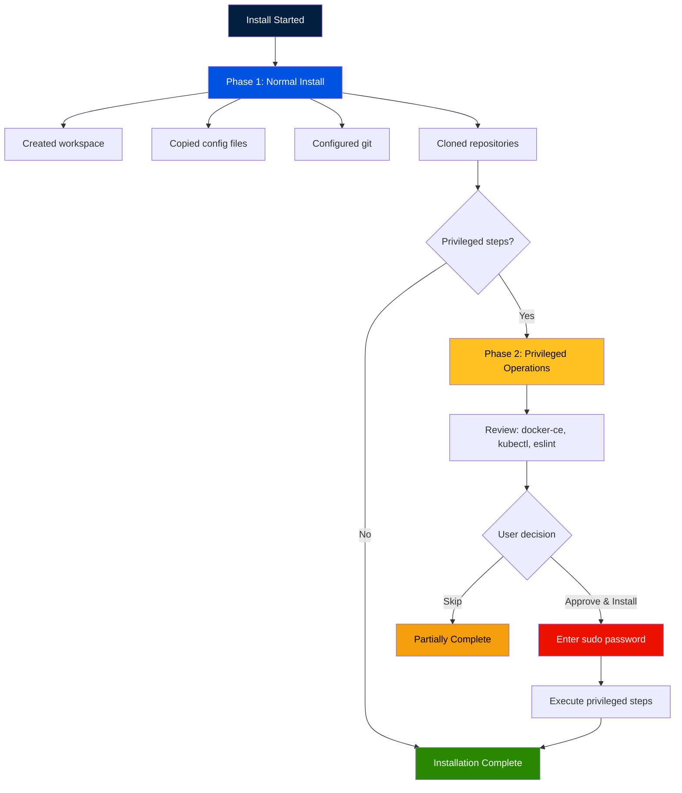

# Privilege Separation

Prism uses a two-phase install model to minimize the time spent running with elevated privileges. Normal operations (file copies, git config, directory creation) run first as the current user. Privileged operations (system package installs, global tool setup) run second, only after explicit user approval.

---

## Two-Phase Install

### Phase 1: Normal Operations (no sudo)

- Create workspace directories
- Copy configuration files
- Write git config
- Clone repositories (via HTTPS)
- Record rollback actions

### Phase 2: Privileged Operations (requires sudo)

- Install system packages (`apt-get install`, `brew install`, `choco install`)
- Configure global tools
- Modify system-level configuration

The UI presents phase 2 steps for review before prompting for a password. The user sees exactly what will run with sudo and can approve or skip.

---

## SudoValidationEngine (Pure Logic)

Manages sudo session lifecycle with no I/O:

### Session Creation

```python
engine = SudoValidationEngine()
session = engine.create_session()
# session.token = <32-byte cryptographically random URL-safe string>
# session.ttl_seconds = 900  (15 minutes)
# session.max_attempts = 3
```

### Session Validation

```python
is_valid = engine.validate_session(session)
# Returns False if:
#   - Session has expired (created_at + ttl_seconds < now)
#   - Session is locked (locked_until > now)
```

### Attempt Tracking

```python
# On successful password validation
session = engine.record_attempt(session, success=True)
# Resets attempt counter to 0

# On failed password validation
session = engine.record_attempt(session, success=False)
# Increments attempt counter
# After 3 failures: locks session for 30 seconds
```

---

## SudoAccessor (I/O)

Handles the actual sudo validation via subprocess:

### Password Validation

```python
accessor = SudoAccessor()
is_valid = accessor.validate_password("user_password")
```

The password is passed via **stdin** to `sudo -S -v`:

- `-S` — read password from stdin (not terminal)
- `-v` — validate only, do not run a command

The password **never** appears in:
- Process argument lists (`/proc/*/cmdline`)
- Log files
- Environment variables
- Shell history

### Availability Check

```python
if accessor.is_sudo_available():
    # sudo binary exists on this system
```

On systems without sudo (some containers, Windows without WSL), the privileged phase is skipped entirely.

---

## Session Model

```python
@dataclass
class SudoSession:
    token: str                         # Cryptographically random, memory-only
    created_at: datetime               # Session start time
    ttl_seconds: int = 900             # 15-minute default
    attempts: int = 0                  # Failed attempt counter
    max_attempts: int = 3              # Lock after this many failures
    locked_until: datetime | None      # None = not locked
```

### Expiry

Sessions expire after `ttl_seconds` (default 15 minutes). After expiry, any operation requiring sudo will prompt for the password again. The TTL is intentionally short to limit the window of elevated access.

### Lockout

After 3 consecutive failed password attempts, the session is locked for 30 seconds. During lockout:

- `validate_session()` returns `False`
- The UI shows a countdown timer
- After 30 seconds, the user can try again (attempt counter remains at 3 until a successful validation resets it)

---

## Security Properties

| Property | Implementation |
|---|---|
| Password never in args | `sudo -S -v` reads from stdin |
| Password never logged | Accessor does not log the password string |
| Password never stored | Passed directly to subprocess, not saved to disk or memory beyond the call |
| Token is memory-only | Never written to disk, never sent over network |
| Token is cryptographic | `secrets.token_urlsafe(32)` — 256 bits of entropy |
| Session is time-limited | 15-minute TTL, checked on every operation |
| Brute force protection | 3-attempt lockout with 30-second backoff |

---

## UI Flow

### Figure 1: Two-Phase Install Flow



If the user clicks **Skip**, phase 2 is not executed. The installation is marked as partially complete, and the skipped steps are logged so the user can run them manually later.

---

## Platform Behavior

| Platform | Sudo Available | Behavior |
|---|---|---|
| macOS | Yes | Full two-phase install |
| Linux | Yes | Full two-phase install |
| WSL2 | Yes | Full two-phase install |
| Windows (native) | No (`sudo` not found) | Phase 2 skipped, user advised to install manually |
| Docker containers | Varies | Depends on container setup |

---

## See Also

- [Architecture](architecture.md) — SudoValidationEngine and SudoAccessor in the system design
- [Rollback System](rollback-system.md) — How rollback handles privileged actions
- [Installation](../getting-started/installation.md) — The full install flow
