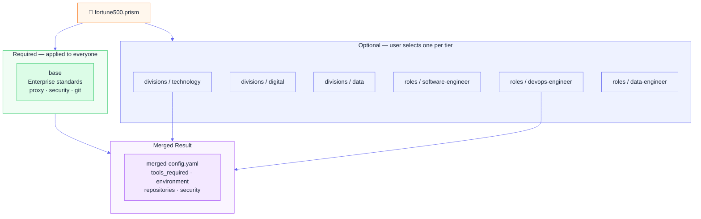
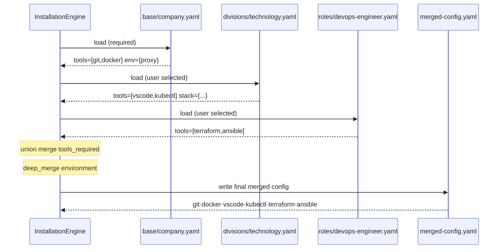

# Sub-Prism Inheritance

## Overview

Every prism can contain a hierarchy of **sub-prisms** declared under `bundled_prisms`. Each sub-prism is a YAML config file that contributes settings to the final merged configuration. Like a prism refracting white light into a spectrum, this system refracts organizational complexity into layered, composable configurations.



Each layer **inherits and extends** from previous layers:

- ✅ Base defines company-wide standards (proxy, security, required tools)
- ✅ Division adds division-specific tools and tech stacks
- ✅ Role adds role-specific tools and workflows
- ✅ Business unit adds compliance and context-specific settings

---

## How Sub-Prism Merging Works

When you install a prism, the engine:

1. Loads all **required** sub-prisms automatically (the `base` tier)
2. Applies any **user-selected** sub-prisms from optional tiers
3. Deep-merges them in declaration order using `ConfigMerger`
4. Writes the merged result to `config/merged-config.yaml`

The merged config drives everything: which tools get installed, which repos get cloned, which proxy settings apply.



### Merge Strategies

Controlled by `config/inheritance.yaml` (or the built-in defaults):

**Arrays (lists):**
```yaml
merge_strategy:
  arrays:
    tools_required: "union"     # Combine, remove duplicates
    resources: "append"         # Keep all, in order
    onboarding_tasks: "append"
```

**Objects (dicts):**
```yaml
merge_strategy:
  objects:
    environment: "deep_merge"   # Recursively merge
    git: "override"             # Later layer wins
    career: "user_only"         # Only the user can set this
```

**Example — union merge:**
```yaml
# Base sub-prism
tools_required: [git, docker, kubectl]

# Role sub-prism
tools_required: [terraform, helm]

# Merged result:
tools_required: [git, docker, kubectl, terraform, helm]
```

**Example — deep_merge:**
```yaml
# Base
environment:
  proxy:
    http: "http://proxy.company.com:8080"
  maven:
    url: "https://maven.company.com"

# Division
environment:
  npm:
    registry: "https://npm.company.com"

# Merged:
environment:
  proxy:
    http: "http://proxy.company.com:8080"
  maven:
    url: "https://maven.company.com"
  npm:
    registry: "https://npm.company.com"
```

---

## Real-World Example

### Scenario: New Developer at Fortune 500

**Selected sub-prisms:**
- `base` → enterprise base (required, auto-applied)
- `divisions/technology.yaml` → Technology Division
- `roles/devops-engineer.yaml` → DevOps Engineer

**Merged result:**
```yaml
# From base:
environment:
  proxy:
    http: "http://proxy.company.com:8080"
  vpn:
    required: true

tools_required:
  - git
  - docker
  - kubectl
  - python3

security:
  sso_required: true
  mfa_required: true

# From Technology Division:
tools_required:
  - vscode
  - docker
  - kubectl

tech_stack:
  languages: [Python, TypeScript, Java]
  platforms: [Kubernetes, AWS, GCP]

# From DevOps Engineer:
tools_required:
  - terraform
  - ansible
  - kubectl
  - docker
  - git
```

**Final merged `tools_required`** (union): `git, docker, kubectl, python3, vscode, terraform, ansible`

---

## Defining Sub-Prisms in `bundled_prisms`

```yaml
bundled_prisms:
  # Required tier — applied to every user
  base:
    - id: "company-base"
      name: "Company Base"
      description: "Company-wide settings: proxy, git, required tools"
      required: true              # ← always included
      config: "base/company.yaml"

  # Optional tier — user picks one
  divisions:
    - id: "technology"
      name: "Technology Division"
      description: "IT and software engineering"
      config: "divisions/technology.yaml"

    - id: "digital"
      name: "Digital Division"
      description: "Digital products and platforms"
      config: "divisions/digital.yaml"

  # Optional tier — user picks one
  roles:
    - id: "software-engineer"
      name: "Software Engineer"
      config: "roles/software-engineer.yaml"

    - id: "devops-engineer"
      name: "DevOps Engineer"
      config: "roles/devops-engineer.yaml"
```

---

## Sub-Prism Config File Structure

Each sub-prism is a plain YAML file. Any keys it contains are merged into the final config:

```yaml
# base/company.yaml
company:
  name: "My Company"
  domain: "mycompany.com"

environment:
  proxy:
    http: "http://proxy.mycompany.com:8080"
  vpn:
    required: true

tools_required:
  - git
  - docker
  - kubectl

security:
  sso_required: true
```

```yaml
# divisions/technology.yaml
division:
  id: "technology"
  name: "Technology Division"

tools_required:
  - vscode
  - kubernetes

tech_stack:
  languages: [Python, TypeScript]
```

```yaml
# roles/devops-engineer.yaml
role:
  id: "devops-engineer"
  name: "DevOps Engineer"

tools_required:
  - terraform
  - ansible
  - helm
```

---

## Environment Variable Substitution

Use `${VAR}` and `${VAR:-default}` placeholders in sub-prism configs:

```yaml
git:
  user:
    name: "${USER}"
    email: "${USER}@mycompany.com"

cloud:
  region: "${CLOUD_REGION:-us-central1}"
```

These are resolved at install time by the engine.

---

## Python API

```python
from scripts.config_merger import load_merged_config

config = load_merged_config(
    company="config/base/company.yaml",
    sub_org="config/orgs/engineering.yaml",
    department="config/departments/supply-chain.yaml",
    team="config/teams/receiving-systems.yaml",
    user="config/user-profile.yaml"
)

proxy = config["environment"]["proxy"]["http"]
tools = config["tools_required"]
repos = config.get("repositories", [])
```

---

## Benefits

✅ **DRY** — define company standards once, inherit everywhere
✅ **Flexible** — each layer can override or extend
✅ **Scalable** — add new teams without duplicating config
✅ **Maintainable** — update the base once, all users get the change
✅ **Contextual** — each developer gets exactly what their role needs
