# Local Documentation Server

After Prism installs your environment, it can serve a local documentation site that gives you a live, browsable view of everything in your workspace — installed tools, cloned repositories, merged configuration, and more.

---

## What It Is

The docs server is a lightweight HTTP server (`docs_server/`) that reads your workspace artifacts and renders them as browsable HTML pages. There is no external dependency, no cloud service, and no account required.

```
http://localhost:8000
```

---

## Pages

| Route | What You See |
|---|---|
| `/` | Workspace overview — prism used, install date, platform |
| `/tools` | All installed tools with version numbers |
| `/repos` | Cloned repositories with status |
| `/config` | Merged configuration viewer (merged-config.yaml rendered) |
| `/prism-docs` | Your prism author's documentation |
| `/help` | Links to the Prism docs/ tree |

---

## Starting the Server

### On-demand

```bash
make serve-docs
# Serves at http://localhost:8000
```

### Background (non-blocking)

```bash
make serve-docs-bg
# Logs to /tmp/prism-docs.log
```

### Direct

```bash
python3 docs_server/server.py --port 8000
```

---

## What It Reads

The server reads from your workspace directory (`~/.prism_workspace/`):

| File | Used For |
|---|---|
| `.prism_installed` | Install metadata (prism name, timestamp, platform) |
| `docs/config/merged-config.yaml` | Tools, repos, environment config |
| `docs/config/selected-sub-prisms.yaml` | Which optional tiers were chosen |
| `docs/config/user-info.yaml` | Your profile (name, team, etc.) |

---

## Prism Author Documentation

If your prism package includes a `docs/` directory, its Markdown files are automatically served at `/prism-docs`. This is how prism authors can ship user-facing documentation alongside their configuration — no separate hosting required.

---

## Architecture

```mermaid
%%{init: {'theme': 'base', 'themeVariables': {'primaryColor': '#eef2ff', 'primaryTextColor': '#1e293b', 'primaryBorderColor': '#6366f1', 'lineColor': '#6366f1', 'secondaryColor': '#f0fdf4', 'tertiaryColor': '#faf5ff', 'background': '#ffffff', 'mainBkg': '#eef2ff', 'nodeBorder': '#6366f1', 'clusterBkg': '#f8faff', 'edgeLabelBackground': '#ffffff'}}}%%

flowchart LR
    subgraph workspace["~/.prism_workspace/"]
        MI[".prism_installed"]
        MC["merged-config.yaml"]
        SS["selected-sub-prisms.yaml"]
        UI["user-info.yaml"]
    end

    subgraph server["docs_server/ (localhost:8000)"]
        SC["workspace_scanner.py"]
        RD["renderer.py"]
        SV["server.py"]
    end

    subgraph pages["Browser"]
        OV["/ Overview"]
        TL["/tools"]
        RP["/repos"]
        CF["/config"]
        PD["/prism-docs"]
    end

    workspace --> SC
    SC --> SV
    RD --> SV
    SV --> pages

    style workspace fill:#f0fdf4,stroke:#22c55e,color:#1e293b
    style server fill:#eef2ff,stroke:#6366f1,color:#1e293b
    style pages fill:#faf5ff,stroke:#a855f7,color:#1e293b
```



The server is built on Python's standard library only — no Flask, no pip dependencies.

---

## See Also

- [Settings Panel](settings-panel.md) — Override registry and CDN settings
- [Configuration Schema](../reference/configuration-schema.md) — Full `package.yaml` reference
